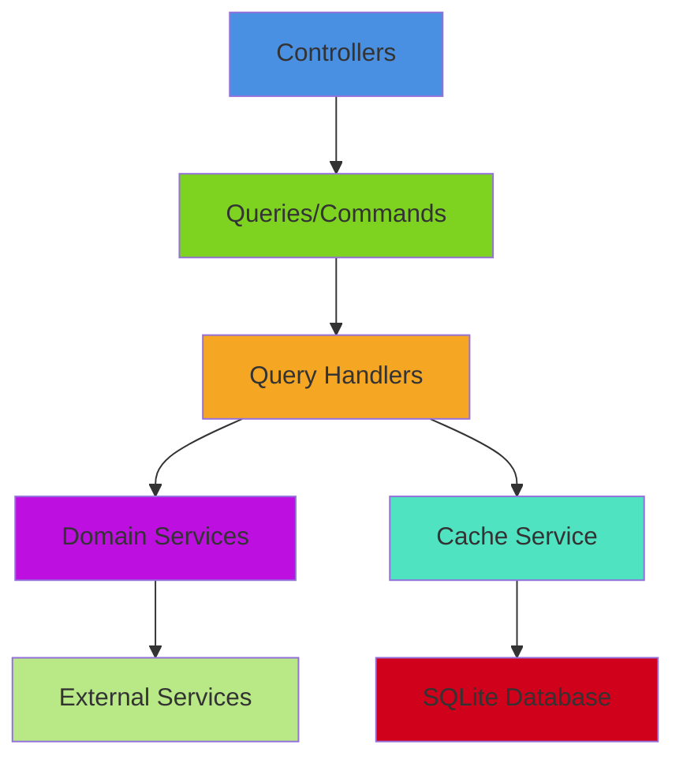
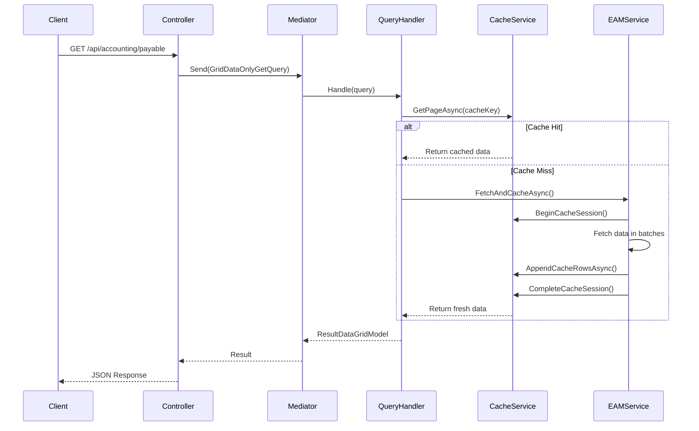

## Overview

HGT EAM WebServices is built following **Clean Architecture** principles with **CQRS** (Command Query Responsibility Segregation) pattern using the **Mediator** pattern for request handling. The solution provides a RESTful API layer over Infor EAM's SOAP-based grid services.

## Solution Structure

The solution consists of three main projects:

```
HGT.EAM.WebServices.sln
├── HGT.EAM.WebServices           # Application layer (API)
├── HGT.EAM.WebServices.Conector  # External integration layer
└── HGT.EAM.WebServices.Infrastructure  # Shared infrastructure
```

### Project Responsibilities

<AccordionGroup>
  <Accordion title="HGT.EAM.WebServices (Application Layer)">
    The main API project containing:
    
    - **Controllers**: REST API endpoints that inherit from `BaseGridController`
    - **Queries**: CQRS query objects using Mediator pattern
    - **Models**: Request/response DTOs
    - **Mapper**: Mapster configuration for object mapping
    - **Setup**: Application configuration and dependency injection

    **Key Files**:
    - `Program.cs` - Application entry point
    - `Startup.cs` - Service configuration and middleware pipeline
    - `ServiceCollectionExtensions.cs` - Dependency injection setup
  </Accordion>

  <Accordion title="HGT.EAM.WebServices.Conector (Integration Layer)">
    Handles external SOAP service communication:
    
    - **Services**: `EAMGridService` - SOAP client wrapper
    - **Interfaces**: Service contracts
    - **Models**: DTOs for EAM integration
    - **Extensions**: Helper methods for data transformation
    - **Connected Services**: Auto-generated SOAP client proxies

    **Key Responsibilities**:
    - SOAP client configuration with WCF
    - X.509 certificate handling
    - Request/response transformation
  </Accordion>

  <Accordion title="HGT.EAM.WebServices.Infrastructure (Shared Layer)">
    Cross-cutting concerns and shared components:
    
    - **GridCache**: SQLite-based caching system
    - **Controller**: Base controller with Mediator integration
    - **Middlewares**: Exception handling, response transformation, validation
    - **Extensions**: Authentication, authorization helpers
    - **Interfaces**: Shared service contracts
  </Accordion>
</AccordionGroup>

## Architecture Patterns

### Clean Architecture Layers

The architecture follows the dependency rule: inner layers know nothing about outer layers.



### CQRS with Mediator Pattern

All requests flow through the Mediator pattern, providing separation of concerns and testability.

**Request Flow**:



**Implementation Example**:

<CodeGroup>
```csharp HGT.EAM.WebServices/Application/Queries/GridDataOnlyGetQuery.cs
public class GridDataOnlyGetQuery : IRequest<ResultDataGridModel>
{
    public GridDataOnlyGetQuery(
        ClaimsPrincipal userInfo, 
        ApiRequestEnum typeFilter, 
        EAMGridSettings gridConfiguration,
        HGTGridEnum gridHGT,
        HGTGridTypeEnum gridTypeHGT,
        int page,
        int? pageSize = null,
        int? month = null, 
        int? year = null)
    {
        // Query initialization
        Username = userInfo?.Identity?.Name;
        Organization = userInfo?.Claims
            .FirstOrDefault(i => i.Type == "Organization")?.Value;
        GridId = gridConfiguration.GridId;
        Page = page;
        // ... more properties
    }
}
```

```csharp HGT.EAM.WebServices/Application/Queries/GridDataOnlyGetQueryHandler.cs
public class GridDataOnlyGetQueryHandler : 
    IRequestHandler<GridDataOnlyGetQuery, ResultDataGridModel>
{
    private readonly IGridCacheService _cache;
    private readonly IEamGridFetcher _fetcher;

    public async ValueTask<ResultDataGridModel> Handle(
        GridDataOnlyGetQuery command, 
        CancellationToken cancellationToken)
    {
        var cacheKey = _cache.ComputeCacheKey(/*...*/);
        
        // Try cache first
        var cached = await _cache.GetPageAsync(cacheKey, page, pageSize);
        if (cached != null) return cached;
        
        // Cache miss: fetch and cache
        await _fetcher.FetchAndCacheAsync(/*...*/);
        
        // Return from cache
        return await _cache.GetPageAsync(cacheKey, page, pageSize);
    }
}
```
</CodeGroup>

### Base Controller Pattern

All controllers inherit from `HGTController`, which provides:

- Mediator integration for CQRS
- Consistent error handling
- Logging infrastructure
- Standardized response formatting

```csharp HGT.EAM.WebServices.Infrastructure/Architecture/Controller/HGTController.cs
public class HGTController(IMediator mediator, ILogger logger) : ControllerBase
{
    protected async Task<IActionResult> ExecuteHandler<TRequest, TResponse>(
        TRequest request,
        HttpStatusCode statusCode = HttpStatusCode.OK,
        CancellationToken cancellationToken = default,
        [CallerMemberName] string callerMemberName = "")
    {
        try
        {
            var result = await _mediator.Send(request, cancellationToken);
            return StatusCode((int)statusCode, result);
        }
        catch (Exception ex)
        {
            _logger.LogError(ex, "Error in {CallerMemberName}", callerMemberName);
            throw;
        }
    }
}
```

## Component Interaction

### Request Processing Pipeline


**Middleware Stack** (defined in `Startup.cs:98-100`):

1. **ExceptionMiddleware** - Global exception handling
2. **ResponseMiddleware** - Response formatting and transformation
3. **QueryParamsValidationMiddleware** - Request validation

### Dependency Injection

Services are registered in `ServiceCollectionExtensions.cs:12-36`:

```csharp
public static IServiceCollection AddApplicationServices(
    this IServiceCollection services, 
    IConfiguration configuration)
{
    // Grid configuration
    var allGrids = configuration.GetSection("EAMGrids")
        .Get<List<EAMGridSettings>>();
    services.AddSingleton(allGrids);
    
    // Core services
    services.AddScoped<IEAMGridService, EAMGridService>();
    services.AddScoped<IGridCacheService, GridCacheService>();
    services.AddScoped<IEamGridFetcher, EamGridFetcher>();
    
    // Cache database
    services.AddDbContext<GridCacheDbContext>(
        options => options.UseSqlite(connectionString));
    
    return services;
}
```

## Configuration Structure

The application requires the following configuration sections:

<Tabs>
  <Tab title="appsettings.json">
    ```json
    {
      "EAMBaseUrl": "https://eam-server/services",
      "EAMCredentials": [
        {
          "Username": "api_user",
          "Password": "***",
          "Organization": "HGT"
        }
      ],
      "EAMGrids": [
        {
          "HGTGridName": "PAYABLE",
          "GridId": 1234,
          "GridName": "SSOACCPAYABL",
          "UserFunction": "SSOACCPAYABL",
          "NumberRecordsFirstReturned": 500,
          "FilterField": "invoicedate",
          "DataSpyIds": {
            "PreviousDay": 100,
            "PreviousMonth": 101,
            "CurrentMonth": 102,
            "LastYear": 103,
            "AllRecords": 104
          }
        }
      ],
      "GridCache": {
        "Enabled": true,
        "ExpirationMinutes": 60
      },
      "ConnectionStrings": {
        "GridCache": "Data Source=gridcache.db"
      }
    }
    ```
  </Tab>
</Tabs>

## Key Design Decisions

<CardGroup cols={2}>
  <Card title="CQRS Pattern" icon="split">
    Separates read operations (queries) from write operations for better scalability and maintainability.
  </Card>
  
  <Card title="Mediator Pattern" icon="message">
    Reduces coupling between controllers and business logic, enabling easier testing and maintenance.
  </Card>
  
  <Card title="SQLite Cache" icon="database">
    Provides persistent caching without external dependencies, ideal for containerized deployments.
  </Card>
  
  <Card title="Streaming Data" icon="stream">
    Fetches large datasets in batches (5000 records) to minimize memory consumption.
  </Card>
</CardGroup>

## Performance Considerations

<Warning>
  The SOAP services can be slow for large datasets. The architecture addresses this through:
  
  - **Persistent caching** with SQLite (default 60 min expiration)
  - **Batch processing** (5000 records per batch)
  - **Session-based pagination** on the EAM server side
  - **Rate limiting** (60 requests/minute per user)
</Warning>

<Info>
  See the [Caching](/concepts/caching) documentation for details on how the cache system optimizes performance.
</Info>

## Next Steps

<CardGroup cols={2}>
  <Card title="Caching System" icon="bolt" href="/concepts/caching">
    Learn how the SQLite cache dramatically improves response times
  </Card>
  
  <Card title="Authentication" icon="lock" href="/concepts/authentication">
    Understand how Basic Auth and rate limiting protect the API
  </Card>
  
  <Card title="API Reference" icon="book" href="/api/overview">
    Explore the available endpoints and request formats
  </Card>
  
  <Card title="Quick Start" icon="rocket" href="/quickstart">
    Get started with your first API request
  </Card>
</CardGroup>
