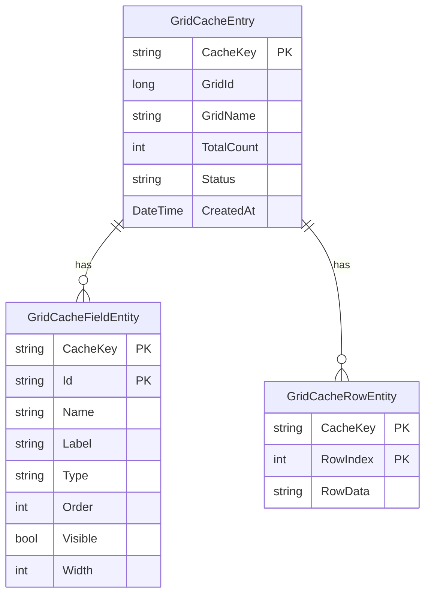
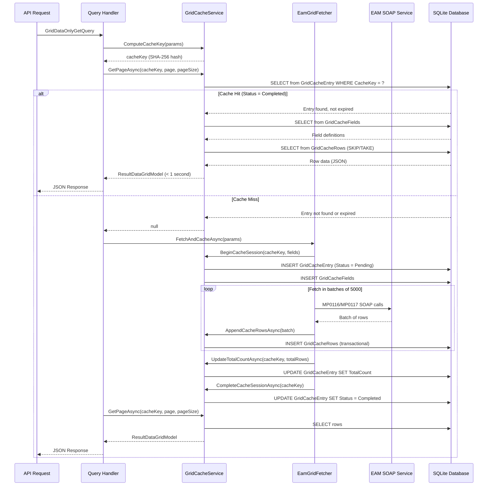

## Overview

HGT EAM WebServices implements a sophisticated **SQLite-based caching system** that dramatically improves performance when querying Infor EAM's SOAP-based grid services. The cache system transforms slow SOAP calls (often 10-30 seconds for large datasets) into sub-second JSON API responses.

<Info>
  **Performance Impact**: First request may take 10-30s while fetching from EAM. Subsequent requests return in under 1 second from SQLite cache.
</Info>

## Why SQLite?

The architecture uses SQLite instead of Redis or in-memory caching for several key reasons:

<CardGroup cols={2}>
  <Card title="Zero Dependencies" icon="cube">
    No external cache server required - works out of the box in Docker, Kubernetes, or bare metal.
  </Card>
  
  <Card title="Persistence" icon="floppy-disk">
    Cache survives application restarts, reducing load on EAM servers during deployments.
  </Card>
  
  <Card title="Low Memory Footprint" icon="memory">
    Large datasets (100k+ rows) stay on disk instead of consuming application memory.
  </Card>
  
  <Card title="Built-in Transactions" icon="lock">
    ACID compliance ensures cache integrity even during concurrent writes.
  </Card>
</CardGroup>

## Cache Architecture

### Database Schema

The cache uses three main tables defined in `GridCacheDbContext.cs:9-28`:



**Table Purposes**:

- **GridCacheEntry**: Metadata about the cached grid (status, record count, creation time)
- **GridCacheFieldEntity**: Column definitions (names, types, display properties)
- **GridCacheRowEntity**: Actual row data stored as JSON strings

### Cache Key Generation

Cache keys are generated using **SHA-256 hashing** to uniquely identify each query combination:

```csharp GridCacheService.cs:126-140
public string ComputeCacheKey(
    string username,
    string organization,
    int gridId,
    string gridName,
    string functionName,
    int dataspyId,
    DateTime? startDate,
    DateTime? endDate,
    string filterField)
{
    var payload = $"{username}|{organization}|{gridId}|{gridName}|" +
                  $"{functionName}|{dataspyId}|{startDate:O}|{endDate:O}|{filterField}";
    var bytes = SHA256.HashData(Encoding.UTF8.GetBytes(payload));
    return Convert.ToHexString(bytes)[..64];
}
```

<Note>
  Cache keys include **username** and **organization**, so different users/orgs never share cached data even for the same grid.
</Note>

## Caching Workflow

### Complete Request Lifecycle



### Step-by-Step Process

<Steps>
  <Step title="Cache Key Generation">
    The system generates a unique SHA-256 hash based on:
    - Username and organization
    - Grid ID and name
    - Filter criteria (date ranges, dataspy ID)
    - Function name
    
    ```csharp
    var cacheKey = _cache.ComputeCacheKey(
        command.Username,
        command.Organization,
        command.GridId,
        command.GridName,
        command.FunctionName,
        command.DataspyId,
        command.StartDate,
        command.EndDate,
        command.FilterField
    );
    ```
  </Step>
  
  <Step title="Cache Lookup">
    The handler attempts to retrieve the requested page from cache:
    
    ```csharp GridDataOnlyGetQueryHandler.cs:39
    var cached = await _cache.GetPageAsync(cacheKey, page, pageSize, cancellationToken);
    if (cached != null) return cached; // Cache hit!
    ```
    
    The cache validates:
    - Entry exists with `Status = "Completed"`
    - Entry is not expired (default 60 minutes)
    - Data integrity is intact
  </Step>
  
  <Step title="Begin Cache Session (Cold Start)">
    If cache miss, initialize a new cache session:
    
    ```csharp GridCacheService.cs:60-105
    await _cache.BeginCacheSessionAsync(cacheKey, fields, gridId, gridName);
    ```
    
    This creates:
    - `GridCacheEntry` with `Status = "Pending"`
    - `GridCacheFieldEntity` records for column definitions
  </Step>
  
  <Step title="Streaming Data Fetch">
    The `EamGridFetcher` retrieves data in batches of 5000 rows:
    
    ```csharp EamGridFetcher.cs:111-191
    do {
        // Fetch batch from EAM
        var rows = await gridService.GetGridRowsAsync(request);
        
        // Accumulate in memory
        bufferRows.AddRange(rows);
        
        // Write to SQLite every 5000 rows
        if (bufferRows.Count >= 5000) {
            await _cache.AppendCacheRowsAsync(cacheKey, bufferRows, startIndex);
            bufferRows.Clear(); // Free memory
        }
    } while (moreRecordsPresent);
    ```
    
    <Warning>
      Batching is critical for memory efficiency. Without it, a 100k-row dataset would consume 500+ MB of RAM.
    </Warning>
  </Step>
  
  <Step title="Complete Cache Session">
    After all data is fetched, mark the cache as ready:
    
    ```csharp GridCacheService.cs:107-124
    await _cache.UpdateTotalCountAsync(cacheKey, totalRows);
    await _cache.CompleteCacheSessionAsync(cacheKey);
    // Status changes from "Pending" to "Completed"
    ```
  </Step>
  
  <Step title="Return Cached Data">
    Finally, retrieve the requested page from the now-complete cache:
    
    ```csharp GridDataOnlyGetQueryHandler.cs:66-70
    var freshResult = await _cache.GetPageAsync(cacheKey, page, pageSize);
    return freshResult;
    ```
  </Step>
</Steps>

## Cache Operations

### Reading from Cache

The `GetPageAsync` method implements efficient pagination:

```csharp GridCacheService.cs:154-236
public async Task<ResultDataGridModel?> GetPageAsync(
    string cacheKey,
    int page,
    int pageSize,
    CancellationToken cancellationToken = default)
{
    // 1. Validate entry exists and is completed
    var entry = await _db.GridCacheEntries
        .FirstOrDefaultAsync(e => e.CacheKey == cacheKey);
    
    if (entry?.Status != "Completed") return null;
    
    // 2. Check expiration
    if ((DateTime.UtcNow - entry.CreatedAt).TotalMinutes > _options.ExpirationMinutes)
    {
        await RemoveCacheAsync(cacheKey);
        return null;
    }
    
    // 3. Fetch field definitions
    var fields = await _db.GridCacheFields
        .Where(f => f.CacheKey == cacheKey)
        .OrderBy(f => f.Order)
        .ToListAsync();
    
    // 4. Paginate rows
    var skip = (page - 1) * pageSize;
    var rows = await _db.GridCacheRows
        .Where(r => r.CacheKey == cacheKey)
        .OrderBy(r => r.RowIndex)
        .Skip(skip)
        .Take(pageSize)
        .ToListAsync();
    
    // 5. Deserialize JSON row data
    var deserializedRows = rows
        .Select(r => DeserializeRow(r.RowData))
        .ToList();
    
    return new ResultDataGridModel { /* ... */ };
}
```

### Writing to Cache

Batch writes use **transactions** to ensure atomicity:

```csharp GridCacheService.cs:28-58
public async Task AppendCacheRowsAsync(
    string cacheKey,
    IReadOnlyList<Dictionary<string, object>> rows,
    int startIndex,
    CancellationToken cancellationToken = default)
{
    using var transaction = await _db.Database.BeginTransactionAsync();
    
    try
    {
        for (var i = 0; i < rows.Count; i++)
        {
            _db.GridCacheRows.Add(new GridCacheRowEntity
            {
                CacheKey = cacheKey,
                RowIndex = startIndex + i,
                RowData = SerializeRow(rows[i]) // JSON serialization
            });
        }
        
        await _db.SaveChangesAsync();
        await transaction.CommitAsync();
    }
    catch
    {
        await transaction.RollbackAsync();
        throw;
    }
}
```

### Cache Invalidation

The system automatically invalidates cache entries when:

1. **Expiration time reached** (default: 60 minutes)
2. **Incomplete cache detected** (Status = "Pending" on read)
3. **Data integrity failure** (row count mismatch)

```csharp GridCacheService.cs:309-314
private async Task RemoveCacheAsync(string cacheKey)
{
    await _db.GridCacheRows.Where(r => r.CacheKey == cacheKey).ExecuteDeleteAsync();
    await _db.GridCacheFields.Where(f => f.CacheKey == cacheKey).ExecuteDeleteAsync();
    await _db.GridCacheEntries.Where(e => e.CacheKey == cacheKey).ExecuteDeleteAsync();
}
```

<Warning>
  Cache invalidation is automatic. Manual invalidation is not currently supported via API.
</Warning>

## Configuration

Configure caching behavior in `appsettings.json`:

```json
{
  "GridCache": {
    "Enabled": true,
    "ExpirationMinutes": 60
  },
  "ConnectionStrings": {
    "GridCache": "Data Source=gridcache.db"
  }
}
```

<ParamField path="GridCache.Enabled" type="boolean" default="true">
  Enable or disable SQLite caching globally. If `false`, all requests hit EAM directly.
</ParamField>

<ParamField path="GridCache.ExpirationMinutes" type="integer" default="60">
  Minutes until a cache entry expires. Set to `0` for no expiration (not recommended).
</ParamField>

<ParamField path="ConnectionStrings.GridCache" type="string" default="Data Source=gridcache.db">
  SQLite database file path. Relative paths are resolved from the application directory.
</ParamField>

## Performance Benchmarks

<CardGroup cols={2}>
  <Card title="First Request (Cache Miss)" icon="clock">
    **10-30 seconds**
    
    Fetches full dataset from EAM SOAP service and populates SQLite cache.
  </Card>
  
  <Card title="Subsequent Requests (Cache Hit)" icon="bolt">
    **< 1 second**
    
    Retrieves data directly from SQLite with pagination.
  </Card>
  
  <Card title="Large Datasets (100k rows)" icon="database">
    **First fetch**: ~45 seconds  
    **Cached reads**: ~500ms per page
  </Card>
  
  <Card title="Memory Usage" icon="memory">
    **Without cache**: ~500MB for 100k rows  
    **With SQLite cache**: ~50MB (90% reduction)
  </Card>
</CardGroup>

## Error Handling

### Incomplete Cache Detection

If a cache session fails mid-fetch (e.g., network error), the status remains `"Pending"`:

```csharp GridCacheService.cs:170-178
if (entry.Status != "Completed")
{
    _logger.LogWarning(
        "Incomplete cache detected for {CacheKey} with status {Status}. Cleaning...",
        cacheKey, entry.Status);
    
    await RemoveCacheAsync(cacheKey);
    return null; // Force refetch
}
```

### Data Integrity Verification

After fetching, the system verifies row count matches:

```csharp EamGridFetcher.cs:206-218
var cachedCount = await _cache.GetCachedRowCountAsync(cacheKey);

if (cachedCount != totalFetched)
{
    _logger.LogError(
        "Integrity check FAILED for {GridName}: Expected {Expected}, got {Actual}",
        gridName, totalFetched, cachedCount);
    
    await _cache.RollbackCacheSessionAsync(cacheKey);
    throw new InvalidOperationException("Integrity check failed");
}
```

## Best Practices

<AccordionGroup>
  <Accordion title="Expiration Time">
    Choose expiration based on data freshness requirements:
    
    - **Financial data**: 15-30 minutes
    - **Operational data**: 5-10 minutes  
    - **Historical/read-only data**: 24 hours or more
    
    Longer expiration reduces EAM server load but may serve stale data.
  </Accordion>
  
  <Accordion title="Database Maintenance">
    SQLite performs well but benefits from occasional maintenance:
    
    ```bash
    # Compact database to reclaim space
    sqlite3 gridcache.db "VACUUM;"
    
    # Rebuild indexes for optimal performance
    sqlite3 gridcache.db "REINDEX;"
    ```
    
    Consider running these during low-traffic periods.
  </Accordion>
  
  <Accordion title="Monitoring Cache Hit Rate">
    Monitor logs for cache effectiveness:
    
    ```
    [Information] Cache hit for key ABC123...
    [Information] Cache miss for key DEF456...
    ```
    
    Low hit rates may indicate:
    - Expiration time too short
    - High query parameter variation
    - Users requesting unique data combinations
  </Accordion>
</AccordionGroup>

## Troubleshooting

<AccordionGroup>
  <Accordion title="Database Locked Errors">
    SQLite uses file-level locking. If you see "database is locked" errors:
    
    1. Check for concurrent writes from multiple instances
    2. Ensure `BusyTimeout` is set (currently: 30 seconds)
    3. Consider switching to WAL mode for better concurrency:
    
    ```csharp
    services.AddDbContext<GridCacheDbContext>(options => 
        options.UseSqlite($"{connectionString};Mode=ReadWriteCreate;Cache=Shared;Journal Mode=WAL"));
    ```
  </Accordion>
  
  <Accordion title="Large Database Files">
    SQLite databases grow as data accumulates. To manage size:
    
    1. **Reduce expiration time** to purge old data faster
    2. **Run VACUUM** periodically to reclaim space
    3. **Implement cleanup job** to delete entries older than 7 days:
    
    ```csharp
    await _db.GridCacheEntries
        .Where(e => e.CreatedAt < DateTime.UtcNow.AddDays(-7))
        .ExecuteDeleteAsync();
    ```
  </Accordion>
  
  <Accordion title="Slow First Requests">
    Large datasets (50k+ rows) take time to fetch initially. To improve UX:
    
    1. **Pre-warm cache** for common queries during off-peak hours
    2. **Adjust page size** - smaller pages return faster on first request
    3. **Use async/await** patterns in client applications
    4. **Consider background jobs** to populate cache proactively
  </Accordion>
</AccordionGroup>

## Next Steps

<CardGroup cols={2}>
  <Card title="Architecture Overview" icon="building" href="/concepts/architecture">
    Understand how caching fits into the overall system design
  </Card>
  
  <Card title="Authentication" icon="lock" href="/concepts/authentication">
    Learn about security and rate limiting
  </Card>
  
  <Card title="API Reference" icon="book" href="/api/overview">
    See how pagination parameters affect cache usage
  </Card>
  
  <Card title="Setup Guide" icon="server" href="/guides/setup">
    Configure caching for production environments
  </Card>
</CardGroup>
