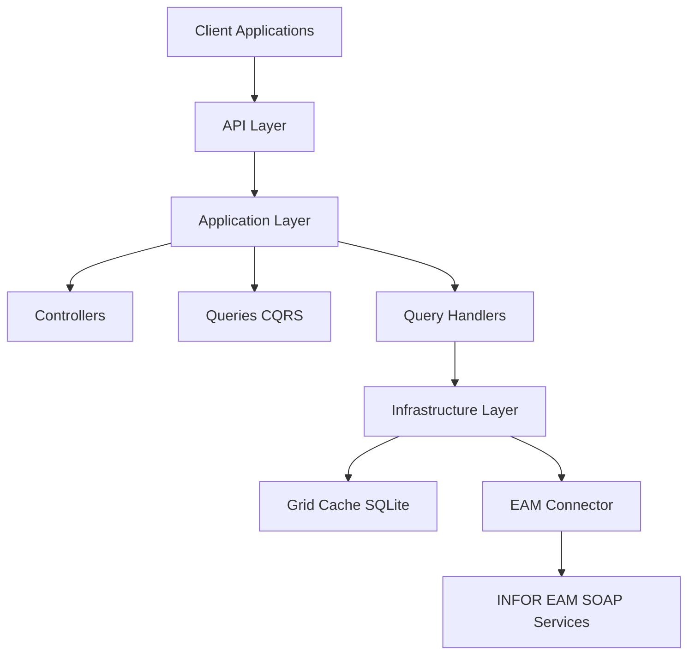

## What is HGT EAM WebServices?

HGT EAM WebServices is a modern **RESTful API gateway** built with .NET 9.0 that provides simplified and optimized access to **INFOR EAM (Enterprise Asset Management)** SOAP web services. Originally developed for HGT (formerly SAAM Terminals), this gateway transforms complex SOAP operations into clean, easy-to-use REST endpoints.

<Note>
  The API acts as an intelligent intermediary between your applications and INFOR EAM, providing caching, rate limiting, and a modern REST interface.
</Note>

## Key Features

<CardGroup cols={2}>
  <Card title="INFOR EAM Integration" icon="link">
    Seamless integration with INFOR EAM SOAP services to fetch grid data and perform operations
  </Card>
  
  <Card title="Intelligent Caching" icon="database">
    SQLite-based persistent caching system for ultra-fast responses and reduced load on EAM servers
  </Card>
  
  <Card title="RESTful API" icon="code">
    Modern REST endpoints with automatic OpenAPI documentation using Scalar
  </Card>
  
  <Card title="Built-in Security" icon="shield">
    Basic authentication and rate limiting (60 requests/minute) to protect your services
  </Card>
  
  <Card title="Clean Architecture" icon="layer-group">
    Follows CQRS pattern with clear separation of concerns using Mediator pattern
  </Card>
  
  <Card title="Production Ready" icon="rocket">
    Includes structured logging with Serilog, error handling, and response caching
  </Card>
</CardGroup>

## Architecture Overview

The project follows **Clean Architecture** principles with a clear separation of concerns:

### Project Structure

The solution consists of three main projects:

<Steps>
  <Step title="HGT.EAM.WebServices">
    The main API project containing:
    - **Controllers**: REST endpoints organized by domain (Accounting, Provision, etc.)
    - **Queries**: CQRS query definitions
    - **Models**: DTOs and request/response models
    - **Setup**: Application configuration and startup logic
  </Step>
  
  <Step title="HGT.EAM.WebServices.Infrastructure">
    Core infrastructure components:
    - **GridCache**: SQLite-based caching system
    - **Base Controllers**: Reusable controller logic
    - **Middlewares**: Exception handling, validation, and response formatting
    - **Query Interfaces**: CQRS abstractions
  </Step>
  
  <Step title="HGT.EAM.WebServices.Conector">
    INFOR EAM integration layer:
    - **IEamGridFetcher**: Interface for fetching EAM grid data
    - **EAM Models**: Domain models for EAM entities
    - **SOAP Client**: Communication with INFOR EAM web services
  </Step>
</Steps>

## Design Patterns

The project leverages several industry-standard design patterns:

<AccordionGroup>
  <Accordion title="CQRS (Command Query Responsibility Segregation)">
    Separates read operations (queries) from write operations (commands) for better scalability and maintainability. All data retrieval uses dedicated query objects and handlers.
  </Accordion>
  
  <Accordion title="Mediator Pattern">
    Uses the Mediator pattern (via MediatR library) to decouple controllers from business logic. Controllers send queries to handlers without direct dependencies.
  </Accordion>
  
  <Accordion title="Repository Pattern">
    Abstracts data access through the GridCache system, providing a clean interface for data persistence and retrieval.
  </Accordion>
  
  <Accordion title="Dependency Injection">
    Leverages .NET's built-in DI container for loose coupling and testability throughout the application.
  </Accordion>
</AccordionGroup>

## How the Caching System Works

The intelligent caching system significantly improves performance:

<Steps>
  <Step title="Initial Request">
    When a client requests grid data, the system first checks if the data exists in the SQLite cache.
  </Step>
  
  <Step title="Cache Miss">
    If data is not found or has expired, the system fetches it from INFOR EAM SOAP services.
  </Step>
  
  <Step title="Store and Return">
    Retrieved data is stored in SQLite cache for future requests and returned to the client.
  </Step>
  
  <Step title="Subsequent Requests">
    Future requests for the same data are served directly from cache, providing near-instant responses.
  </Step>
</Steps>

<Note>
  Cache expiration is configurable via `GridCache.ExpirationMinutes` in appsettings.json (default: 60 minutes).
</Note>

## API Categories

The API organizes endpoints into logical categories:

| Category | Description | Example Endpoints |
|----------|-------------|------------------|
| **Abastecimiento** (Provision) | Purchase orders, contracts, and procurement data | `/api/provisions/purchase/order`, `/api/provisions/contracts` |
| **Contabilidad** (Accounting) | Transactions and accounting reports | `/api/accounting/transactions`, `/api/accounting/kardex` |
| **Cuentas por Pagar** | Accounts payable data | `/api/accounts-payable/*` |
| **Control de Gestión** | Management and control reports | `/api/management/*` |

## Technology Stack

<CardGroup cols={3}>
  <Card title=".NET 9.0" icon="microsoft">
    Latest .NET framework for high performance
  </Card>
  
  <Card title="ASP.NET Core" icon="server">
    Web API framework
  </Card>
  
  <Card title="Mediator" icon="arrows-split-up-and-left">
    CQRS pattern implementation
  </Card>
  
  <Card title="Mapster" icon="arrow-right-arrow-left">
    Fast object-to-object mapping
  </Card>
  
  <Card title="SQLite" icon="database">
    Lightweight caching database
  </Card>
  
  <Card title="Serilog" icon="file-lines">
    Structured logging
  </Card>
  
  <Card title="Scalar" icon="book">
    OpenAPI documentation UI
  </Card>
  
  <Card title="Entity Framework Core" icon="table">
    Data access for cache
  </Card>
</CardGroup>

## Use Cases

HGT EAM WebServices is ideal for:

- **Web Applications**: Build dashboards and reporting tools that need EAM data
- **Mobile Apps**: Access EAM information through a modern REST API
- **Integration Projects**: Connect third-party systems to INFOR EAM
- **Data Analytics**: Extract EAM data for business intelligence and analytics
- **Automation**: Create automated workflows that interact with EAM data

<Warning>
  This project is designed for internal use at HGT (SAAM Terminals) and requires valid INFOR EAM credentials to function.
</Warning>

## Next Steps

<CardGroup cols={2}>
  <Card title="Quickstart" icon="rocket" href="/quickstart">
    Get started with installation and your first API call
  </Card>
  
  <Card title="API Reference" icon="book" href="/api/overview">
    Explore all available endpoints and their parameters
  </Card>
</CardGroup>